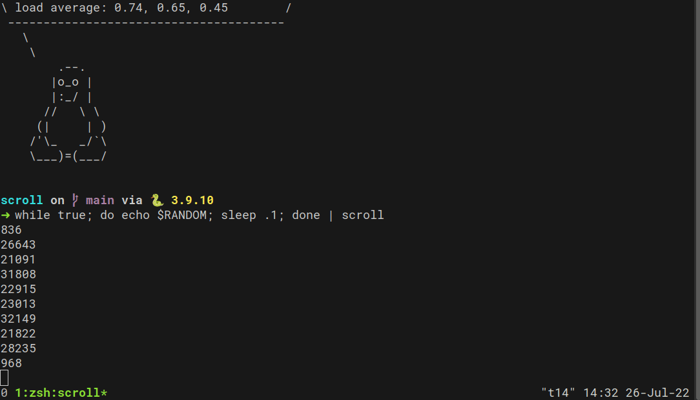

# scroll



## Install
```
pip install scroll-term
```

## Examples
```bash
# scroll system logs output stream
journalctl -f | scroll

# scroll MIDI messages
aseqdump | scroll

# scroll text, with a 1 sec delay
scroll -d 1 file.txt

# scroll full height
some-command | scroll -l 0
```

## Usage

```
usage: scroll [-h] [-d DELAY] [-l LINES] [file]

Scroll stdout!

positional arguments:
  file                  file, defaults to stdin

optional arguments:
  -h, --help            show this help message and exit
  -d DELAY, --delay DELAY
                        delay in seconds between lines (default 0)
  -l LINES, --lines LINES
                        max lines, set to 0 for full screen (default 10)
```

## Use it as a library

```python
from scroll_term.cli import scroll

with open("path/to/file", "r") as f:
    scroll(f, delay=0.2)
```
